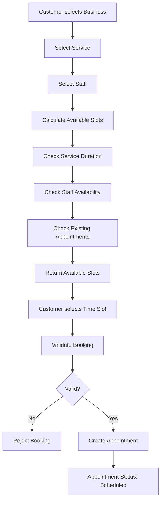

# Yuggenda API - Booking Flow

## Overview

The booking flow describes how an appointment is created after a customer selects a business, service, staff member, and available time slot.

The system validates the booking against the business context, service configuration, staff availability, and existing appointments before creating the appointment.

## Booking Flow

## Booking Validation

Before creating an appointment, the system validates:

* The business exists and is accessible within the appropriate business context.
* The customer belongs to the selected business.
* The service belongs to the selected business.
* The selected staff member belongs to the selected business.
* The selected staff member is assigned to the selected service.
* The service is active.
* The requested time falls within the staff member's availability.
* The complete service duration fits within a single availability period.
* The selected time does not conflict with another active appointment.
* The appointment uses the business timezone when interpreting the requested local date and time.

## Appointment Creation

If all validations succeed:

1. The requested local date and time are interpreted using the business timezone.
2. The appointment start and end times are converted to an absolute instant.
3. The appointment is created with the `Scheduled` status.
4. The appointment is persisted.

## Booking Conflicts

A booking must be rejected when:

* The selected staff member is not available.
* The service is not assigned to the selected staff member.
* The requested time falls outside the staff member's availability.
* The service duration exceeds the remaining availability period.
* Another active appointment overlaps the requested time.
* The service is inactive.
* Any required business relationship is invalid.

The final availability check must be performed when creating the appointment to prevent a previously available slot from being booked after another appointment has already reserved it.
